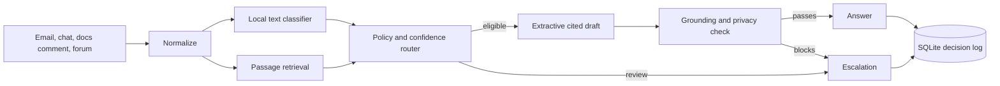

# Architecture and operating notes

The corpus contains 29 supplied articles, split at second-level headings. The classifier is a weighted nearest-neighbor model trained on the 500 supplied development tickets. Retrieval uses TF-IDF weighted cosine similarity over title and passage text. It refuses matches below 0.075. Raw classifier confidence combines closest-example similarity and agreement among seven neighbors. A deterministic grouped holdout of the development data maps raw score bands to observed accuracy, with shrinkage for small bands. Calibration should be rechecked on a larger representative set before production use.

Routing is ordered: operator kill switch, prompt injection, private data, empty ticket, policy categories, ambiguous historical routing, no relevant source, confidence floor, then cited answer. An extractive answer can only include lines from one retrieved passage. Citation IDs are checked against the current retrieved set before release. Every decision is written to SQLite, including escalations.

The HTTP console demonstrates decisions; `evaluation.harness` is the reproducible batch interface. The public demo should use synthetic tickets only. For a production service, add authentication, tenant isolation, durable hosted storage, rate limiting, and independent customer outcome measurement. The free Render filesystem is ephemeral, so download evaluation outputs or run the harness locally for persistent records. Set `AUTO_RESPONSE_ENABLED=false` to halt automatic answers immediately for subsequent requests.
